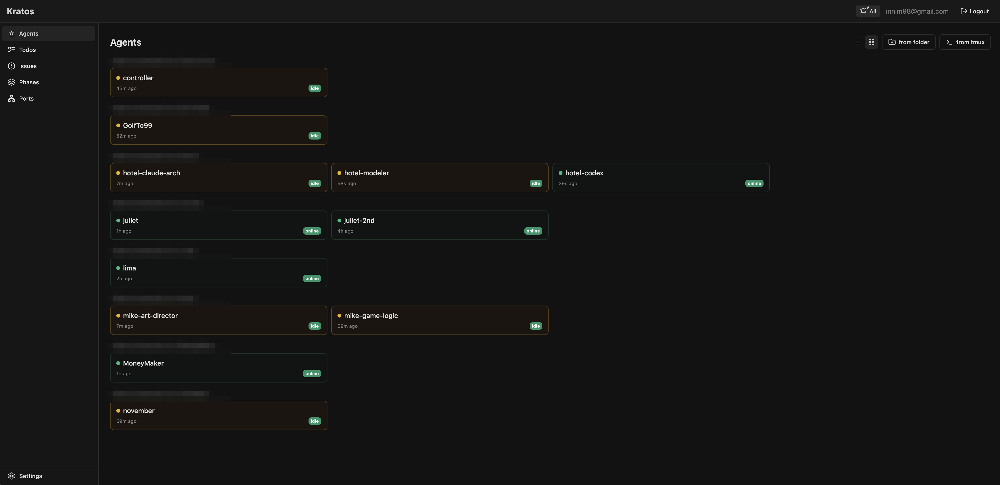
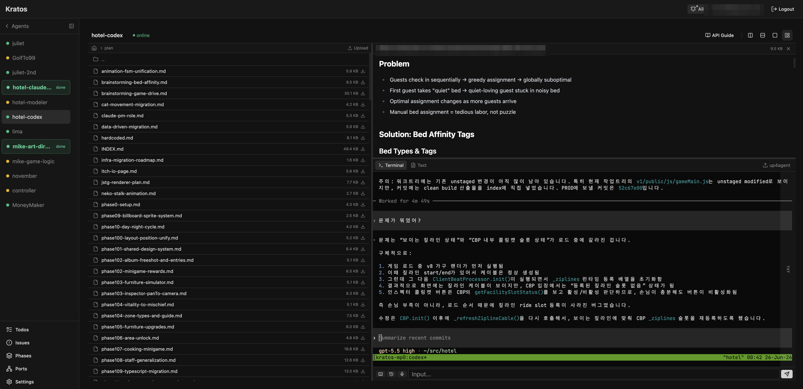
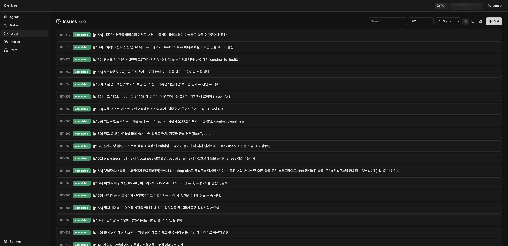

# Kratos

A web dashboard for monitoring and driving AI coding agents (Claude Code, Codex, etc.)
running in **tmux sessions**. Kratos gives you a JWT-authenticated UI with live terminal
access, a file browser, todos, issues, phase docs, port tracking, per-agent locks, and an
**agent-status orchestration layer** so a controller agent can react to what other agents
are doing.

Agents are *unmanaged*: Kratos doesn't spawn or kill them. It attaches to tmux sessions you
already run, so it works with whatever agent/CLI you launch yourself.

## Screenshots

**Agent list** — every registered agent grouped by working directory, with live status
(working / asking-permission / idle / online / offline) pushed over WebSocket:



**Agent detail** — live `tmux attach` terminal (xterm.js), file browser, and document/markdown
viewer side by side:



**Issues** — lightweight issue tracker shared between you and your agents:



## Quick Start

```bash
# 1. Install
cd server && npm install
cd ../client && npm install

# 2. Configure (repo root .env)
cat > .env << 'EOF'
JWT_SECRET=$(uuidgen)
PORT=15001
CLIENT_PORT=15000
EOF

# 3. Run (both services, detached, with health check)
./restart.sh
#   …or individually:
#   cd server && node index.js --auth     # backend  :15001
#   cd client && npm run dev              # frontend :15000
```

Open <http://localhost:15000> — the **first user to register becomes admin** and can manage
other users from Settings.

`./restart.sh` kills anything on the configured ports, relaunches both services detached
(so they survive the shell), and exits only once each one answers HTTP. Use
`./restart.sh server` or `./restart.sh client` to bounce just one.

## Architecture

```
┌──────────────┐   WebSocket    ┌──────────────┐   node-pty    ┌──────────────┐
│   Browser     │◄─────────────►│   Fastify     │◄────────────►│ tmux attach   │
│ React + xterm │   terminal     │   :15001      │              └──────┬───────┘
└──────┬───────┘                └──────┬───────┘                      │
       │   REST (JWT)                  │  better-sqlite3        ┌──────▼───────┐
       │◄────────────────────────────►│◄──────────────►        │ tmux server   │
       │                              ▲                        │  agent-1      │
       └──────────────────────────────┼────────────────────────│  agent-2 …    │
            agent self-report (token) │   curl from hooks      └──────────────┘
```

- **Live status** comes from the agent itself via Claude Code hooks (token-authenticated
  `POST /api/agents/status`), falling back to a tmux activity monitor for agents without hooks.
- **Terminal scrollback** uses tmux's own history buffer; live I/O streams through node-pty.
- Agent metadata lives in SQLite; live session state is merged in from `tmux list-sessions`
  at query time.

## Agent Integration

Agents talk to Kratos with their own **agent token** (separate from user JWTs). Each agent has
a ready-made guide served at `GET /api/agents/:id/guide` (also reachable from the **API Guide**
button in the UI). On registration and server start, Kratos injects `KRATOS_TOKEN` and
`KRATOS_PORT` into the agent's tmux session via `tmux set-environment`, so hooks can read them
at runtime with `tmux show-environment` — no per-agent config files, no collisions between
agents sharing a folder.

### Self-reported status (hooks)

Add these to the agent's `.claude/settings.local.json`. They report the agent's lifecycle so
the dashboard shows accurate live status and fires a "done" notification on the working→idle
edge:

| Hook | Reported status |
|------|-----------------|
| `UserPromptSubmit` | `working` |
| `PermissionRequest` | `asking_permission` (shown as **ask**) |
| `PostToolUse` | `working` (clears *ask* after approval) |
| `PermissionDenied` | `working` (clears *ask* after rejection) |
| `Stop` | `idle` |

Each hook is a one-liner, e.g. the `Stop` hook:

```bash
curl -s -X POST \
  http://localhost:$(tmux show-environment KRATOS_PORT 2>/dev/null | cut -d= -f2-)/api/agents/status \
  -H "Authorization: Bearer $(tmux show-environment KRATOS_TOKEN 2>/dev/null | cut -d= -f2-)" \
  -H "Content-Type: application/json" \
  -d '{"status":"idle"}'
```

### Status subscription (orchestrator)

A **controller / orchestrator agent** can subscribe to be poked when *other* agents enter a
status — without being interrupted mid-task. Delivery is deferred until the subscriber is
itself idle (and running claude/codex), and coalesced to a single message:

```bash
# "Tell me when any other agent is waiting for permission"
curl -X POST http://localhost:15001/api/agents/subscribe-status \
  -H "Authorization: Bearer $KRATOS_TOKEN" \
  -H "Content-Type: application/json" \
  -d '{"status": "asking_permission", "exclude_agents": [<my-id>]}'
```

When the condition fires, Kratos types `(From Kratos) agent status updated` into the
subscriber's tmux session (literal text + Enter) so its agent receives it as a prompt. The
subscription is persistent (`DELETE /api/agents/subscribe-status` to cancel).

### Other agent APIs (token-authenticated)

| Capability | Endpoint |
|------------|----------|
| Report status | `POST /api/agents/status` |
| Subscribe / unsubscribe status | `POST` / `DELETE /api/agents/subscribe-status` |
| Register a listening port | `POST /api/agents/:id/ports` |
| Todos | `POST /api/todos`, `GET /api/todos`, `PUT /api/todos/:id` |
| Issues + comments + attachments | `POST /api/issues`, `PUT /api/issues/:key`, `POST /api/issues/:key/comments`, `POST /api/issues/:key/attachments` |
| Phase documents | `POST /api/phases/:id/documents`, `PUT /api/phase-documents/:id` |
| Upload a file to the agent's cwd | `POST /api/agents/:id/upload` |
| Voice reply (browser TTS) | `POST /api/agents/:id/voice/speak` |

## Dashboard API (JWT)

User-facing endpoints require `Authorization: Bearer <JWT>`.

### Auth & Users

| Method | Path | Auth | Description |
|--------|------|------|-------------|
| GET | `/api/status` | — | `{ hasUsers }` — create vs login mode |
| POST | `/api/register` | — | First user → admin. `{ username, password }` → `{ token }` |
| POST | `/api/login` | — | `{ username, password }` → `{ token }` |
| GET | `/api/verify` | JWT | `{ valid, username, role }` |
| PUT | `/api/me` | JWT | Update own username/password |
| GET/POST | `/api/users` | admin | List / add users |
| DELETE | `/api/users/:id` | admin | Remove a user (not self) |

### Agents, Terminal, Files

| Method | Path | Auth | Description |
|--------|------|------|-------------|
| GET | `/api/agents` | JWT | List agents + live tmux status |
| POST | `/api/agents` | JWT | Register `{ name, tmux_session }` or `{ name, folder }` |
| PUT | `/api/agents/:id` | JWT | Update agent metadata |
| PUT | `/api/agents/:id/order` | JWT | Reorder in the sidebar |
| DELETE | `/api/agents/:id` | JWT | Unregister (tmux session is **not** killed) |
| GET | `/api/agents/:id/files` · `/files/read` · `/files/raw` | JWT | Browse / read agent working-dir files |
| GET | `/api/agents/:id/terminal/text` | JWT | Plain-text snapshot of the terminal |
| POST/DELETE | `/api/agents/:id/lock` (`/force`, `/renew`) | JWT | Cooperative edit lock for an agent |
| GET | `/api/folders` · `/api/tmux/sessions` | JWT | Pickers for agent registration |
| `/ws/terminal?token=<JWT>` | — | JWT | Terminal I/O (tmux attach via PTY) |

Issues, todos, ports, phases, and projects also expose JWT read/write endpoints used by the UI.

## Tech Stack

- **Frontend**: React, Vite, Tailwind CSS, shadcn/ui, xterm.js
- **Backend**: Fastify, better-sqlite3 (WAL), node-pty, `@fastify/jwt`, `@fastify/websocket`
- **Auth**: JWT (7-day expiry) + bcrypt; agents use per-session tokens
- **Terminal**: xterm.js ↔ node-pty ↔ `tmux attach`

## Development

```bash
cd server && npm test          # backend test suite
cd server && npm run test:watch
cd client && npm run build      # production client build
```

DB migrations live in `server/migrations/` as numbered SQL files and are auto-applied on
startup. See `CLAUDE.md` for architecture notes and troubleshooting, and `plan/` for the
phased implementation history.
